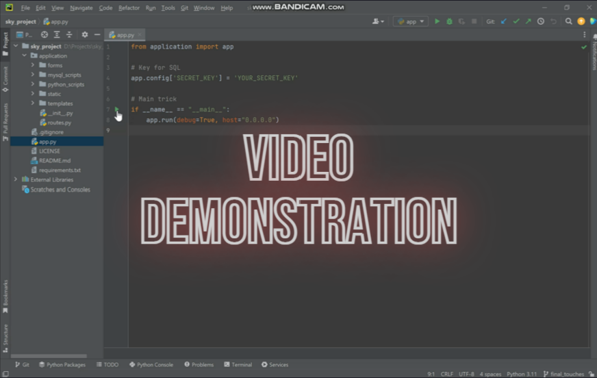

### 🐏 Forty Winks
- Sky Get Into Tech Course 
- Final Project 
- Date of completion: April 2023
- Team: Pam, Mati, Mirfat and Sara

***

### 💻 Project info

Forty Winks is an app that caters to people who have trouble sleeping providing a calming and immersive audio/visual 
experience to promote relaxation to help our users sleep.

The main goal was to build a full stack application in less than 3 weeks applying all the skills acquired during the 
15-week course including showcasing the final product.

***

### 💡 Main Features
- MVP: Landing + Media + Tips + Contact page
- Extras: upon completion of the MVP we focused on developing some extras to our website.
  - Email: when a user completes the contact form, we implemented the functionality for our website sending an email to Forty Winks Gmail.
  - Admin section: this is a hidden website to the user where admins of forty Winks can log in and manage the database behind the Media functionality. In this section, admins can perform full CRUD functionality as they can Add, View, Update and Delete media items.
- Formatting: use of Bootstrap (carousel, featurettes, accordion, forms, navigation bar), Google Fonts, icon buttons.
- Responsive website, can be used on computer, tablet and mobiles.

***

### 💾 Tech stack and applied practices
- Agile: 4 sprints, backlog, scrum master, retrospective and kanban board.
- Pair programming.
- Miro, Jitsi, Slack for communication and organisation.
- Python 3,11, PyCharm, MySQL, Git, GitHub, VSCode.
- HTML, CSS, Bootstrap, Jinja for front end.
- Python, MySQL and Flask for back end.

***

### 🎥 Video Demonstration

