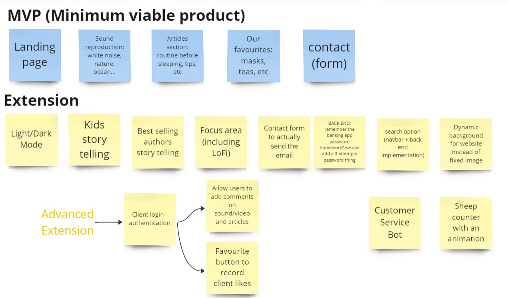

### 🐏 Forty Winks
- Sky Get Into Tech Course Final Project 
- Date of completion: April 2023
- Team: [Pam](https://github.com/Pammy48), [Mati](https://github.com/HelloMati), [Mirfat](https://github.com/Mirfat-tech), [Sara](https://github.com/SaraClick)

***

### 📋 Contents

- [🐏 Forty Winks](#-forty-winks)
- [� Contents](#-contents)
- [💻 Project info](#-project-info)
- [🔄 Our Process](#-our-process)
- [💡 Main Features](#-main-features)
- [🛠️ Tech stack and applied practices](#️-tech-stack-and-applied-practices)
- [🐏 Forty Winks Installation Guide](#-forty-winks-installation-guide)
- [🌐 Inside the app](#-inside-the-app)
- [🎥 Video Demonstration](#-video-demonstration)

***

### 💻 Project info

Forty Winks is a full-stack app designed to provide a relaxing ambience to help users sleep peacefully. 

Stop counting sheep, get Forty Winks!

🎯 Our main goal was to develop a robust full-stack application within a tight deadline of less than 3 weeks. Throughout the project, we applied the skills and knowledge acquired during the intensive 15-week Sky Get Into Tech course and we are excited to showcase the final product.

***

### 🔄 Our Process

Note: The provided diagrams represent the initial design and may not reflect the final implementation.

The project started with defining the requirements of our Minimum Viable Product (MVP) and refining them to ensure an achievable goal.

We successfully implemented the MVP, along with additional extensions, including a hidden admin login section.

The Entity-Relationship (EER) diagram represents the database structure and entity relationships, facilitating the implementation of essential functionalities for Forty Winks.

***

### 💡 Main Features
- MVP: Landing + Media + Tips + Contact page
- Extras: After completing the MVP, we focused on developing extra features, including:
  - Email: When a user completes the contact form, we implemented the functionality for our website to send an email to Forty Winks Gmail.
  - Admin section: This is a hidden website accessible only to admins of Forty Winks. Admins can log in and manage the database behind the Media functionality. In this section, admins can perform full CRUD functionality—they can Add, View, Update and Delete media items.
- Formatting: We utilised Bootstrap for various components such as carousels, featurettes, accordions, forms and navigation bar. Additionally, Google Fonts and icon buttons were incorporated.
- Responsive website: The website is designed to be responsive and can be accessed and used on various devices, including computers, tablets, and mobiles.

***

### 🛠️ Tech stack and applied practices
- Agile: 4 sprints, backlog, scrum master, retrospective and kanban board.
- Pair programming.
- Miro, Jitsi, Slack for effective communication and organisation.
- Python 3.11, PyCharm, MySQL, Git, GitHub, VSCode.
- HTML, CSS, Bootstrap, Jinja for front end.
- Python, MySQL and Flask for back end.

***

### 🐏 Forty Winks Installation Guide

Note: The installation guide assumes basic knowledge of working with Python, MySQL and Flask. If you encounter any issues during the installation process, refer to the official documentation for the relevant software or seek assistance from the development community.

📋 Prerequisites
Before you begin the installation process, please ensure that you have the following prerequisites installed:

-Python: Install Python 3.11 or higher on your machine. You can download the latest version of Python from the official website (https://www.python.org/downloads/).

-MySQL: Install MySQL server on your system. You can download MySQL from the official website (https://dev.mysql.com/downloads/workbench/).

-pip: Make sure you have pip installed. It is the package installer for Python. You can check if pip is installed by running the following command in your terminal:

pip --version

If pip is not installed, you can install it by following the instructions on the official pip website (https://pip.pypa.io/en/stable/installation/).

🚀 Installation

1. Clone the repository:

git clone https://github.com/SaraClick/sky_project.git

2. Navigate to the project directory:

cd sky_project

3. Install the required packages:

pip install -r requirements.txt

4. Set up the database:

Create a MySQL database named FortyWinks.
Import the SQL files located at application/mysql_scripts into the FortyWinks database.

5. Start the Flask application:

flask run

6. Go to http://localhost:5000 in your web browser to view the website.

Note: Please make sure to have MySQL installed and running before proceeding with the installation, as the app relies on MySQL for proper database functionality. 

***

### 🌐 Inside the app 

Once the app is up and running, you can access it in your web browser. The main features of Forty Winks include:

- Landing page: Provides an overview of the app and its features.
- Media section: Offers a collection of relaxing media content, including ambient audio-visual sounds.
- Tips section: Provides helpful tips and techniques for improving sleep quality.
- Contact page: Allows users to get in touch with the Forty Winks team.

***

### 🎥 Video Demonstration

***

🎉 Enjoy Forty Winks!

We hope that Forty Winks provides a soothing experience and helps you achieve a better night's sleep. Thank you for your interest and support in our project. Sweet dreams! 😴

